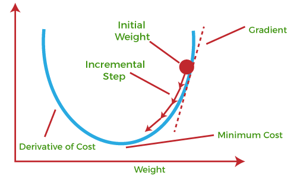
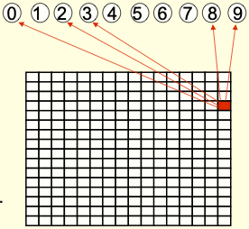
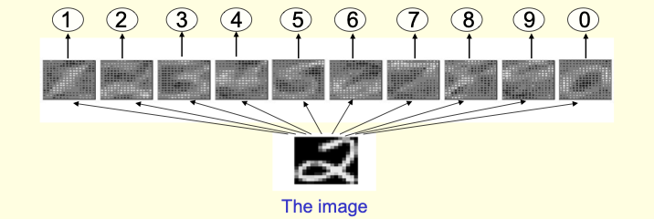

# **Modelos sencillitos de aprendizaje**

### Curso Reconocimiento de Patrones 

**LCC/UNISON**

Julio Waissman

---

# Problema de regresión

- $x = (x_1, \ldots, x_n) \in \mathrm{R}^n$
- $y \in \mathrm{R}$
- Conjunto de aprendizaje $\{(x^{(1)}, y^{(1)}), \ldots, (x^{(M)}, y^{(M)})\}$
- Usar la *matriz de diseño* $X$ y $Y$

---

# Regresión lineal

La hipótesis de base es:
$$h_\theta(x) = w_1 x_1 + \cdots + w_n x_n + b$$

- $\theta = (w_1, \ldots, w_n, b) \in \mathrm(R)^{n+1}$
- $w = (w_1, \ldots, w_n)$ vector de pesos (*weights*) y $b$ el sesgo (*bias*)

---

# Una funcion de pérdida

$$loss(y, \hat{y}) = \frac{1}{2} (y - \hat{y})^2$$

$$\hat{y} = h_\theta(x) = \sum_{j = 1}^n w_j x_j + b = x^T w + b$$

---

# El error en muestra

$$E_i(h_\theta) = \frac{1}{M} \sum_{i = 1}^M \frac{1}{2}\big(y^{(i)} - (w^T x^{(i)} + b)\big)^2$$

- Se conoce como *Error cuadrado medio* (MSE)
- Se puede resolver en forma analítica
- Vamos a resolverlo en forma numérica 

---

# Descenso de gradiente




- [GD en Wikipedia](https://en.wikipedia.org/wiki/Gradient_descent)

---

# El algoritmo de mínimos cuadrados 

```python
def grad_desc(w0, b0, X, y, alpha, max_epoch):

  M = y.shape[0]
  w, b = w0.copy(), b0
  e_hist = []
  for _ in range(max_epoch):
    y_est = X @ w0 + b
    e = np.square(y - y_est).mean() / (2 * M)
    dw = -(X.T @ (y - y_est)) / M
    db = -(y - y_est) / M
    w -= alpha * dw
    b -= alpha * db
    e_hist.append(e)
  return w, b, e_hist
```
---

# Algunas preguntas

1. ¿Cuando sirve el modelo de regresión lineal?
2. ¿El MSE es la mejor función de pérdida?
3. ¿Cómo se podría extender a que fuera más útil?

---

# Problema de clasificación binaria

- $x = (x_1, \ldots, x_n) \in \mathrm{R}^n$
- $y \in \{-1, 1\}$
- Conjunto de aprendizaje $\{(x^{(1)}, y^{(1)}), \ldots, (x^{(M)}, y^{(M)})\}$

---

# Clasificación lineal

La hipótesis de base es:
$$h_\theta(x) = \text{sign} \big(w_1 x_1 + \cdots + w_n x_n + b\big)$$

- $\theta = (w_1, \ldots, w_n, b) \in \mathrm(R)^{n+1}$
- $w = (w_1, \ldots, w_n)$ vector de pesos (*weights*) y $b$ el sesgo (*bias*)

---

# La funcion de pérdida mas simple

$$loss(y, \hat{y}) = [\![y = \hat{y}]\!]$$

$$\hat{y} = h_\theta(x) = \sum_{j = 1}^n w_j x_j + b = x^T w + b$$

La operación $[\![p]\!]$ se conoce como *Iverson bracket* y es la función indicadora.

---

# El error en muestra

$$E_i(h_\theta) = \frac{1}{M} \sum_{i = 1}^M [\![y^{(i)} - (w^T x^{(i)} + b)]\!]$$

- Se conoce como *0/1 Loss*
- Vamos a resolverlo con el PLA

---

# Perceptron Learning Algorithm (PLA)

```python
def pla(x, y, alpha, max_epochs):
  M, n = x.shape
  indicadores = list(range(n))
  w, b = np.random.random((n, )), np.random.random()
  for _ in max_epochs:
    random.shuffle(indicadores)
    for i in indicadores:
      if y[i] != np.sign(x[i,:] @ w + b):
        w += alpha * y[i] * x[i,:] 
        b += alpha * y[i]
        break
    else:
      break
  return w, b
```

---

# Ejemplo de perceptrón



---


# Ejemplo de perceptrón


---


# Ejemplo de perceptrón


---


# Ejemplo de perceptrón


---


# Ejemplo de perceptrón


---


# Ejemplo de perceptrón


---


# Ejemplo de perceptrón


---


# Ejemplo de perceptrón


---


# Ejemplo de perceptrón



---


# Ejemplo de perceptrón


---

# Algunos problemas

- ¿El PLA tiene solución única?
- ¿El PLA asegura convergencia en algún sentido?
- ¿La *0/1 Loss* es la mejor función de costo?

---

# Otra forma de hacer clasificación

¿Y si convertimos el problema de clasificación en un problema de regresión?

$$\Pr[y = 1 | x; \theta] = g_\theta(x) \in [0, 1]$$

$$h_\theta(x) = \left\{\begin{array} 1 1 & \text{si }g_\theta(x) > u \\ -1 & \text{en otro caso} \end{array}\right.$$

- Un problema de regresión (encontrar $\theta$)
- Un problema de clasificación (encontrar el umbral $u$)